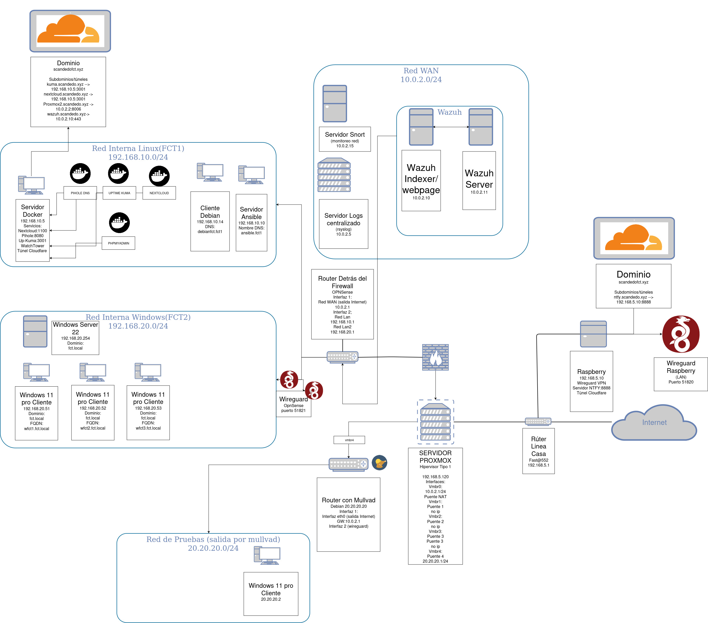

Proyecto Final: Infraestructura de Ciberseguridad con EDR  
Índice 

    Introducción 
    Arquitectura de la Red 
    Componentes Principales 
    Instalación y Configuración 
    Herramientas Utilizadas 
    Automatización 
    Monitoreo y Detección de Amenazas 
    Notificaciones y Respuesta a Incidentes 
    Documentación Adicional 
     

Introducción  

Este proyecto tiene como objetivo diseñar e implementar una infraestructura de ciberseguridad basada en una solución EDR (Endpoint Detection and Response). La arquitectura incluye herramientas avanzadas de monitoreo, detección de intrusiones y respuesta automatizada a incidentes. Se ha utilizado una combinación de tecnologías open source, como Proxmox, OPNsense, Wazuh, Snort y Docker, para garantizar un entorno seguro y escalable. 

La infraestructura está diseñada para: 

    Proteger endpoints críticos contra amenazas avanzadas.
    Monitorear todo el tráfico de red en tiempo real.
    Generar alertas automáticas y notificaciones ante posibles incidentes.
    Facilitar la gestión centralizada de logs y eventos de seguridad.
     

Arquitectura de la Red  

El diseño de la red se divide en varias subredes para asegurar la segmentación y minimizar riesgos: 

    Red Principal (192.168.5.0/24):  Gestión de servidores y servicios principales.
    Red Linux (192.168.10.0/24):  Máquinas virtuales y contenedores Docker.
    Red Windows (192.168.20.0/24):  Servidores y estaciones de trabajo Windows.
    Red de Pruebas (20.20.20.0/24):  Ambiente controlado para simulaciones de ataques.
    Túnel de Cloudflare:  Enrutamiento seguro hacia servicios internos.
     

 
Nota: Añade un diagrama visual de la red si lo tienes disponible.  
Componentes Principales  
1. Proxmox Virtual Environment  

    Plataforma de virtualización utilizada para gestionar máquinas virtuales y contenedores.
    Configuración de puertos NAT y bridges para habilitar conexiones entre redes.
     

2. OPNsense  

    Router principal encargado del enrutamiento y filtrado de tráfico.
    Implementación de reglas de firewall para bloquear comunicaciones no deseadas entre redes.
    Configuración de servidores WireGuard para acceso remoto seguro.
     

3. Wazuh  

    Sistema de detección de intrusos basado en host.
    Monitorización de endpoints (servidores, PCs, laptops).
    Alertas en tiempo real y análisis forense.
     

4. Snort  

    Sistema de detección de intrusiones de red (NIDS).
    Reglas personalizadas para detectar actividades sospechosas, como pings al servidor principal.
     

5. Docker  

    Contenedores para servicios específicos (Nextcloud, Pi-hole, Uptime Kuma, NTFY).
     

Instalación y Configuración  
Pasos Clave  

    Configuración de Proxmox:  
        Creación de interfaces de red (vmbr0, vmbr1, vmbr2, etc.).
        Configuración de NAT y reenvío de puertos.
         

    Configuración de OPNsense:  
        Asignación de interfaces WAN, LAN y OPT.
        Configuración de reglas de firewall y políticas de seguridad.
         

    Instalación de Wazuh:  
        Despliegue de componentes Indexer, Server y Dashboard.
        Configuración de agentes en endpoints.
         

    Configuración de Snort:  
        Instalación y configuración de reglas personalizadas.
        Monitoreo de tráfico en tiempo real.
         

    Despliegue de Docker:  
        Creación de archivos docker-compose.yml para servicios específicos.
        Configuración de persistencia mediante volúmenes.
         
     

Herramientas Utilizadas  

    Administración de Red: 
        OPNsense, WireGuard, iptables.
         
    Seguridad: 
        Wazuh, Snort, Squid (proxy).
         
    Virtualización y Contenedores: 
        Proxmox, Docker, Docker Compose.
         
    Automatización: 
        Ansible, crontab, systemd.
         
    Monitoreo y Logs: 
        Rsyslog, Uptime Kuma, NTFY.


```yaml
---
- name: Configuración de rsyslog como cliente
  hosts: all
  become: yes
  vars:
    servidor_syslog: "10.0.2.5"
    archivo_conf_rsyslog: "/etc/rsyslog.conf"
    servicio_rsyslog: "rsyslog"
  tasks:
    - name: Instalar rsyslog
      apt:
        name: rsyslog
        state: present
      when: ansible_os_family == "Debian"

    - name: Configurar rsyslog para enviar logs al servidor central
      lineinfile:
        path: "{{ archivo_conf_rsyslog }}"
        insertafter: EOF
        line: "*.* @{{ servidor_syslog }}:514"  # UDP

    - name: Reiniciar el servicio rsyslog
      service:
        name: "{{ servicio_rsyslog }}"
        state: restarted
```
Monitoreo y Detección de Amenazas  
Wazuh  

    Monitorización continua de eventos en endpoints.
    Generación de alertas ante comportamientos anómalos.
    Panel de control para análisis forense.
     

Snort  

    Reglas personalizadas para detectar tráfico sospechoso.
    Ejemplo de regla:

    profile
Qwen2.5-Plus 11:21 am
 

¡Perfecto! He revisado el contenido del archivo que compartiste, y a continuación, te proporcionaré un README.md profesional para tu repositorio de GitHub. Este documento estará estructurado de manera clara y detallada, destacando los aspectos clave de tu proyecto finalizado de EDR. 
Proyecto Final: Infraestructura de Ciberseguridad con EDR  
Índice 

    Introducción 
    Arquitectura de la Red 
    Componentes Principales 
    Instalación y Configuración 
    Herramientas Utilizadas 
    Automatización 
    Monitoreo y Detección de Amenazas 
    Notificaciones y Respuesta a Incidentes 
    Documentación Adicional 
     

Introducción  

Este proyecto tiene como objetivo diseñar e implementar una infraestructura de ciberseguridad basada en una solución EDR (Endpoint Detection and Response). La arquitectura incluye herramientas avanzadas de monitoreo, detección de intrusiones y respuesta automatizada a incidentes. Se ha utilizado una combinación de tecnologías open source, como Proxmox, OPNsense, Wazuh, Snort y Docker, para garantizar un entorno seguro y escalable. 

La infraestructura está diseñada para: 

    Proteger endpoints críticos contra amenazas avanzadas.
    Monitorear todo el tráfico de red en tiempo real.
    Generar alertas automáticas y notificaciones ante posibles incidentes.
    Facilitar la gestión centralizada de logs y eventos de seguridad.
     

Arquitectura de la Red  

El diseño de la red se divide en varias subredes para asegurar la segmentación y minimizar riesgos: 

    Red Principal (192.168.5.0/24):  Gestión de servidores y servicios principales.
    Red Linux (192.168.10.0/24):  Máquinas virtuales y contenedores Docker.
    Red Windows (192.168.20.0/24):  Servidores y estaciones de trabajo Windows.
    Red de Pruebas (20.20.20.0/24):  Ambiente controlado para simulaciones de ataques.
    Túnel de Cloudflare:  Enrutamiento seguro hacia servicios internos.
     

 
Nota: Añade un diagrama visual de la red si lo tienes disponible.  
Componentes Principales  
1. Proxmox Virtual Environment  

    Plataforma de virtualización utilizada para gestionar máquinas virtuales y contenedores.
    Configuración de puertos NAT y bridges para habilitar conexiones entre redes.
     

2. OPNsense  

    Router principal encargado del enrutamiento y filtrado de tráfico.
    Implementación de reglas de firewall para bloquear comunicaciones no deseadas entre redes.
    Configuración de servidores WireGuard para acceso remoto seguro.
     

3. Wazuh  

    Sistema de detección de intrusos basado en host.
    Monitorización de endpoints (servidores, PCs, laptops).
    Alertas en tiempo real y análisis forense.
     

4. Snort  

    Sistema de detección de intrusiones de red (NIDS).
    Reglas personalizadas para detectar actividades sospechosas, como pings al servidor principal.
     

5. Docker  

    Contenedores para servicios específicos (Nextcloud, Pi-hole, Uptime Kuma, NTFY).
     

Instalación y Configuración  
Pasos Clave  

    Configuración de Proxmox:  
        Creación de interfaces de red (vmbr0, vmbr1, vmbr2, etc.).
        Configuración de NAT y reenvío de puertos.
         

    Configuración de OPNsense:  
        Asignación de interfaces WAN, LAN y OPT.
        Configuración de reglas de firewall y políticas de seguridad.
         

    Instalación de Wazuh:  
        Despliegue de componentes Indexer, Server y Dashboard.
        Configuración de agentes en endpoints.
         

    Configuración de Snort:  
        Instalación y configuración de reglas personalizadas.
        Monitoreo de tráfico en tiempo real.
         

    Despliegue de Docker:  
        Creación de archivos docker-compose.yml para servicios específicos.
        Configuración de persistencia mediante volúmenes.
         
     

Herramientas Utilizadas  

    Administración de Red: 
        OPNsense, WireGuard, iptables.
         
    Seguridad: 
        Wazuh, Snort, Squid (proxy).
         
    Virtualización y Contenedores: 
        Proxmox, Docker, Docker Compose.
         
    Automatización: 
        Ansible, crontab, systemd.
         
    Monitoreo y Logs: 
        Rsyslog, Uptime Kuma, NTFY.
         
     

Automatización  

Se han implementado varios scripts y playbooks de Ansible para automatizar tareas repetitivas: 
Ejemplo de Playbook Ansible  

```yaml
- name: Configuración de rsyslog como cliente
  hosts: all
  become: yes
  vars:
    servidor_syslog: "10.0.2.5"
    archivo_conf_rsyslog: "/etc/rsyslog.conf"
    servicio_rsyslog: "rsyslog"
  tasks:
    - name: Instalar rsyslog
      apt:
        name: rsyslog
        state: present
      when: ansible_os_family == "Debian"

    - name: Configurar rsyslog para enviar logs al servidor central
      lineinfile:
        path: "{{ archivo_conf_rsyslog }}"
        insertafter: EOF
        line: "*.* @{{ servidor_syslog }}:514"  # UDP

    - name: Reiniciar el servicio rsyslog
      service:
        name: "{{ servicio_rsyslog }}"
        state: restarted
 
 ```
Monitoreo y Detección de Amenazas  
Wazuh  

    Monitorización continua de eventos en endpoints.
    Generación de alertas ante comportamientos anómalos.
    Panel de control para análisis forense.
     

Snort  

    Reglas personalizadas para detectar tráfico sospechoso.
    Ejemplo de regla:

    alert icmp any any -> 10.0.2.2 any (msg:"Ping a Servidor Proxmox Detectado"; sid:1000001; rev:1;)
     
     
     

Notificaciones y Respuesta a Incidentes  

Se ha implementado un sistema de notificaciones basado en NTFY y Cloudflare Tunnel: 

    NTFY:  
        Servicio de notificaciones HTTP pub-sub.
        Envío de mensajes a dispositivos móviles o escritorios.
         

    Cloudflare Tunnel:  
        Enrutamiento seguro hacia servicios internos sin exponer puertos.
         
     
